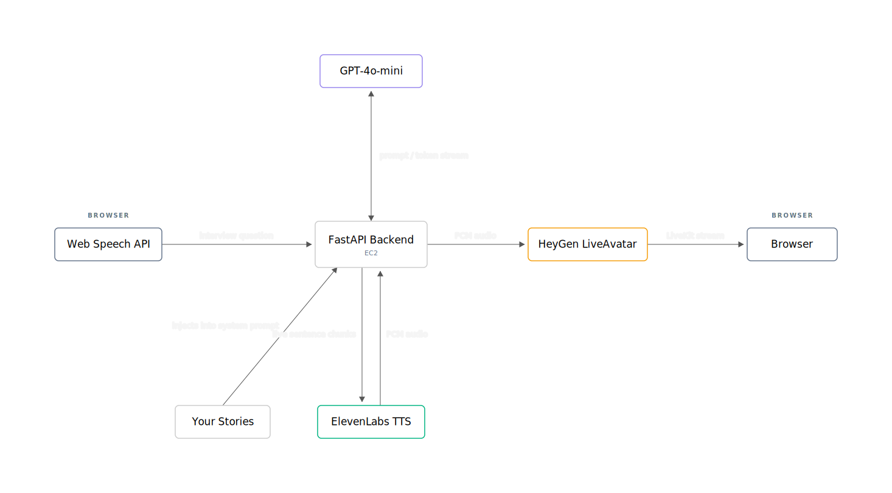

# BehavioralClone

Real-time AI behavioral interview simulator. You speak your answer; an AI interviewer responds in voice and video live. Your stored interview stories are injected into the prompt so the AI answers as you.

> **Chrome only** — the app relies on the WebSpeech API for transcription.

## How it works

You speak into Chrome. WebSpeech transcribes the answer and sends it to the backend, which streams a response through OpenAI, synthesizes audio with ElevenLabs, and forwards it to a HeyGen LiveAvatar. The avatar renders synced video and audio in the browser over LiveKit.



## Stack

| Layer | Technology |
|---|---|
| Frontend | React 18 · TypeScript · Vite · livekit-client · WebSpeech API |
| Backend | FastAPI · SQLAlchemy async · Uvicorn |
| LLM | OpenAI gpt-4o-mini |
| TTS | ElevenLabs eleven_turbo_v2_5 |
| Avatar | HeyGen LiveAvatar LITE · LiveKit |
| Database | PostgreSQL 16 · RDS |
| Infra | EC2 · Nginx · Docker |

## Local Development

**Prerequisites:** Python 3.12+, Node.js 20+, PostgreSQL 16 (or the SQLite fallback below).

```bash
# Backend
python -m venv .venv
source .venv/bin/activate        # Windows: .venv\Scripts\activate
pip install -r requirements.txt -r requirements-dev.txt
cp .env.example .env             # fill in API keys
uvicorn app.main:app --reload --port 8000

# Frontend (separate terminal)
cd frontend && npm install && npm run dev   # http://localhost:5173
```

No local Postgres? Use SQLite: `pip install aiosqlite` and set `DATABASE_URL=sqlite+aiosqlite:///:memory:` in `.env`.

Copy `.env.example` to `.env` and fill in the OpenAI key, ElevenLabs key + cloned voice ID, HeyGen key + avatar ID, and the access passcode. Load your stories via `/admin`. See `.env.example` for the full list.


